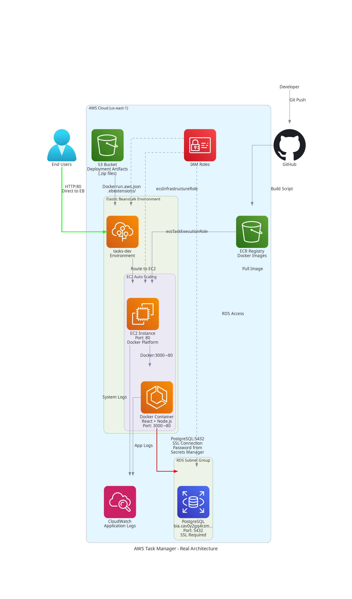

# Tasks Application - Modern Task Management Project

### Full-stack web application with React and Node.js

## 🖥️ Application Preview


## 🏗️ AWS Architecture



## 📁 Project Structure

```
tasks-application/
├── app/
│   ├── frontend/          # React App
│   │   ├── src/           # React source code
│   │   ├── public/        # Public files
│   │   ├── build/         # Production build
│   │   └── package.json   # Frontend dependencies
│   ├── backend/           # Node.js API
│   │   ├── api/           # Controllers and routes
│   │   ├── config/        # Configurations
│   │   ├── database/      # Migrations
│   │   ├── lib/           # Utilities
│   │   ├── index.js       # Main server
│   │   └── package.json   # Backend dependencies
│   └── Dockerfile         # Application container
├── aws/                   # AWS Infrastructure
│   ├── .ebextensions/     # Elastic Beanstalk configurations
│   ├── build-and-push-public.sh  # Build and deploy script
│   ├── deploy.sh          # Deploy script
│   └── .env               # Environment variables
└── README.md
```

## 🚀 Technologies

**Frontend:**
- React 17
- Dark/Light Theme
- Internationalization (PT/EN)
- Modern CSS with variables

**Backend:**
- Node.js + Express
- PostgreSQL
- Sequelize ORM
- RESTful API

**AWS:**
- Elastic Beanstalk
- RDS PostgreSQL
- ECR (Container Registry)
- Docker

## 🛠️ Local Development

### Frontend
```bash
cd app/frontend
npm install
npm start  # http://localhost:3000
```

### Backend
```bash
cd app/backend
npm install
npm start  # http://localhost:3000
```

## 📦 AWS Deployment

### Build and Push
```bash
cd aws
source .env
./build-and-push-public.sh
```

### Deploy
```bash
./deploy.sh v-YYYYMMDD-HHMMSS
```

## 🎯 Features

- ✅ Modern interface with dark theme
- ✅ Task management (CRUD operations)
- ✅ Priority marking
- ✅ Internationalization PT/EN
- ✅ Responsive design
- ✅ RESTful API
- ✅ Automated AWS deployment

## 📋 API Endpoints

- `GET /api/tarefas` - List tasks
- `POST /api/tarefas` - Create task
- `GET /api/tarefas/:uuid` - Get task
- `PUT /api/tarefas/update_priority/:uuid` - Update priority
- `DELETE /api/tarefas/:uuid` - Delete task

## 🌐 Application URL

**Production:** http://task-dev.us-east-1.elasticbeanstalk.com
